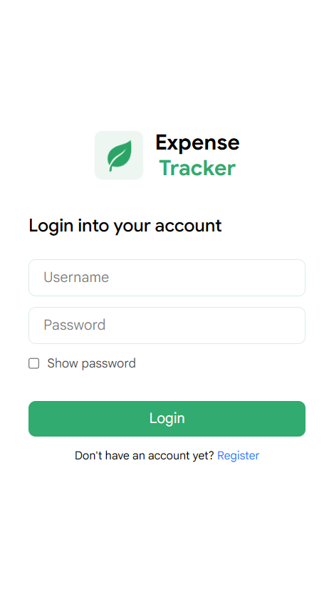
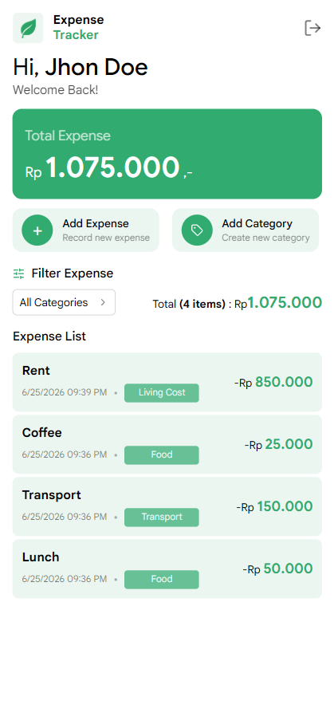

# 💰 Expense Tracker

A modern and responsive expense tracking application built with **React.js, Context API, and TailwindCSS.**

This project helps users record daily expenses, manage categories, and monitor spending habits through a simple and intuitive interface.


## 🚀 Features

**🔐 Authentication**

- Login system
- Protected routes
- Custom `useAuth()` hook
- Logout functionality

**💵 Expense Management**

- Add new expense
- Track expense amount
- Add expense description
- Record expense date
- Real-time total expense calculation

**🏷️ Category Management**

- Create custom categories
- Manage expense categories
- Dynamic category selection
- Category-based filtering

**🔍 Expense Filtering**

- Filter expenses by category
- View all expenses
- Instant filtering results

**📊 Expense Summary**

- Total expense overview
- Categorized expense records
- Clean transaction history display

**🎨 UI / UX**

- Modern finance-inspired design
- Mobile-first responsive layout
- Reusable component architecture
- Modal-based forms
- Smooth interactions
- TailwindCSS styling

## 📸 Screenshots

<table>
  <tr>
    <td align="center">
      <strong>Login Page</strong><br>
      
    </td>
    <td align="center">
      <strong>Dashboard</strong><br>
      
    </td>
  </tr>
</table>


## 🛠️ Tech Stack

| Technology | Description |
|------------|-------------|
| React.js | Frontend Library |
| Vite | Development Environment |
| Context API | Global State Management |
| React Router DOM | Routing |
| TailwindCSS | Styling |
| Lucide React | Icons |
## 📂 Project Structure

```
src
│
├── components/
│   ├── AddCategoryModal.jsx
│   ├── AddExpenseModal.jsx
│   ├── ExpenseFilter.jsx
│   ├── ProtectedRoute.jsx
│   │
│   └── ui/
│       ├── Button.jsx
│       └── ErrorAlert.jsx
│
├── context/
│   ├── AuthContext.jsx
│   ├── CategoryContext.jsx
│   └── ExpenseContext.jsx
│
├── hooks/
│   └── useAuth.js
│
├── layouts/
│   └── RootLayout.jsx
│
├── pages/
│   ├── Dashboard.jsx
│   ├── ErrorPage.jsx
│   ├── Login.jsx
│   ├── Logout.jsx
│   └── Register.jsx
│
├── routes/
│   └── AppRoutes.jsx
│
├── App.jsx
├── index.css
└── main.jsx
```
## ⚙️ Installation

**1. Clone Repository**

```
git clone https://github.com/mwldnp/expense-tracker.git
cd expense-tracker
```

**2. Install Dependencies**
```
npm install
```

**3. Run Development Server**
```
npm run dev
```
## 🌐 Live Demo

https://expense-tracker-bywildan.vercel.app


## 🔗 Links
[](https://wildanpratama.vercel.app//)
[](https://www.linkedin.com/mwldnp)
[](https://instagram.com/mwldnp)

